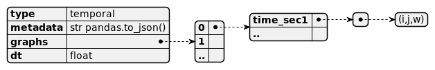
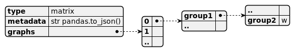

# Networks available 

The networks available for each data set are:
* `DYN`: dynamical network
* `dHET`: Daily heterogeneous network
* `HET`: Heterogeneous network
* `CMD`: Contact matrix of distribution
* `CMB`: Contact matrix of bimodal distributions
* `CM`: Contact matrix
* `FULL`: Fully connected

They are contained in a compressed `gzip` file of a json string in three different formats

## File formats
### Temporal networks
`DYN` comes in the format of temporal networks. `graphs` is a list of `ndays` dictionaries.
Each dictionary has as a key the time (in seconds) of the day, and as value a
list of triplets `(i,j,w)` , repectively index of node `i`, index of node `j` and the weight `w` of the interaction at 
that time.

### Daily netwokrs
`dHET`, `HET`, `CMD`, `CMB` comes in the format of daily graphs. 
`graphs` is a list of `ndays` lists.
Each list represents the graph of interactions for a day
list of triplets `(i,j,w)` , repectively index of node `i`, index of node `j` and the weight `w` of the interaction at 
that day. In the case of `HET`, there is only one unique graph (`ndays=1`).

### Matrices of contacts
`CM` and `FULL` come in the format of matrices of contacts between groups. `graphs` is a dictionary of dictionaries, 
where the keys are the categories (deparments in office dataset, classes in school dataset, role in hospital dataset).

