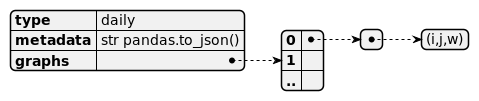

# Networks
## Settings
The dataset used are available in [sociopatterns.org](http://www.sociopatterns.org/).
* `office`  [Contacts in a workplace, 2nd deployment](http://www.sociopatterns.org/datasets/test/) [1]
* `hospital`[Hospital ward dynamic contact network](http://www.sociopatterns.org/datasets/hospital-ward-dynamic-contact-network/) [2]
* `school`[Primary school temporal network data](http://www.sociopatterns.org/datasets/primary-school-temporal-network-data/) [3]
* `cprepa`[High school contact and friendship networks](http://www.sociopatterns.org/datasets/high-school-contact-and-friendship-networks/) [4]

For purposes of the simulations, data has been treated and aggregated in differents ways as described in [5].

## Representations
The networks available for each dataset are:
* `DYN`: dynamical network
* `dHET`: Daily heterogeneous network
* `HET`: Heterogeneous network
* `CMD`: Contact matrix of distribution
* `CMB`: Contact matrix of bimodal distributions
* `CM`: Contact matrix
* `FULL`: Fully connected

They are contained in a compressed `gzip` file of a json string in three different formats

## File formats
### Temporal networks
`DYN` comes in the format of temporal networks. `graphs` is a list of `ndays` dictionaries.
Each dictionary has as a key the time (in seconds) of the day, and as value a
list of triplets `(i,j,w)` , repectively index of node `i`, index of node `j` and the weight `w` of the interaction at 
that time.

### Daily netwokrs
`dHET`, `HET`, `CMD`, `CMB` comes in the format of daily graphs. 
`graphs` is a list of `ndays` lists.
Each list represents the graph of interactions for a day
list of triplets `(i,j,w)` , repectively index of node `i`, index of node `j` and the weight `w` of the interaction at 
that day. In the case of `HET`, there is only one unique graph (`ndays=1`).

### Matrices of contacts
`CM` and `FULL` come in the format of matrices of contacts between groups. `graphs` is a dictionary of dictionaries, 
where the keys are the categories (deparments in office dataset, classes in school dataset, role in hospital dataset).

## Bibliography
* [1] "Can co-location be used as a proxy for face-to-face contacts?", M. Génois and A. Barrat, EPJ Data Science 7, 11 (2018).
* [2] P. Vanhems et al., Estimating Potential Infection Transmission Routes in Hospital Wards Using Wearable Proximity Sensors, PLoS ONE 8(9): e73970 (2013).
* [3] High-Resolution Measurements of Face-to-Face Contact Patterns in a Primary School,
PLOS ONE 6(8): e23176 (2011)
* [4] R. Mastrandrea, J. Fournet, A. Barrat,
Contact patterns in a high school: a comparison between data collected using wearable sensors, contact diaries and friendship surveys.
PLoS ONE 10(9): e0136497 (2015)
* [5]  Contreras, D. A., Colosi, E., Bassignana, G., Colizza, V., & Barrat, A. (2022). [Impact of contact data resolution on the evaluation of interventions in mathematical models of infectious diseases. Journal of the Royal Society Interface, 19(191), 20220164.]
