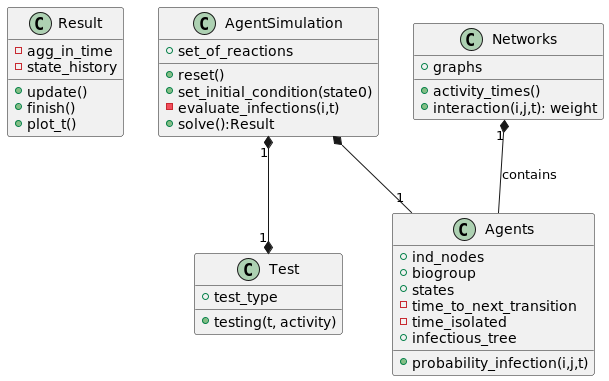

# Epidemic Simulation

The scripts and code shared here allows to simulate the propagation in different types of networks and contact patterns, 
considering a compartmental model for COVID in particular, as presented in the pre-print "Impact of the representation
of contact data on the evaluation of interventions in infectious diseases simulations" [1]. Used dataset and networks  
are included and described in [this document](NETWORKS.md).

In addition, non-pharmaceutical interventions (NPI) can be added, which test and isolate individuals following a protocol (individuals with symptoms can be tested and isolated if they test positive, or regular tests can be proactively applied to a portion of the population).

The result is agent simulations where at each timestep each infected individual is evaluated for possible new infections to susceptible neighbors.

The simulation returns a Result object, which can come in three levels of detail to choose from, from final size only, number of tests used and total quarantine days for each individual run, to a complete detail of infectious trees of who infected whom at what time, and the detailed status of each node over time.

## Overview of the repository

The repository includes the folders,
* `Networks`: contains json files with the networks used, aggregated with different level of detail following [1]
* `EpiKit`: with the code  defining the simulation of agents

The repository includes the files
* `covid_model`: where using classes from EpiKit, we define a model for covid
* `sistematic_simulations.py` : script to run several runs of simulation under the same condition.  
* `example_office_simulation.ipynb` : notebook to illustrate the use of the library. 

 A simplified and non-exhausitive UML visualization of the classes of the code is presented here.

Extensive documentation on the architecture and use of the code is not included.

## Requirements
The code makes use of the standart libraries
* `numpy`
* `pandas`
* `matplotlib`

And the suplemental libraries
* `networkx`
* `json`
* `gzip`

## Bibliography
[1] Contreras, D. A., Colosi, E., Bassignana, G., Colizza, V., & Barrat, A. (2022).[Impact of the representation of contact data on the evaluation of interventions in infectious diseases simulations. ](https://www.medrxiv.org/content/10.1101/2022.02.28.22271600v1) medRxiv.
